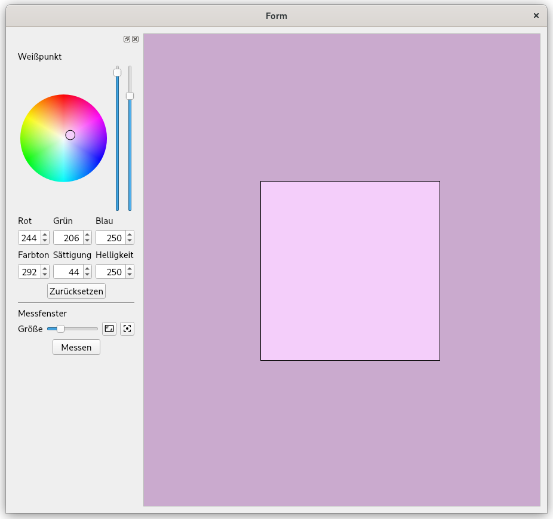

# VisualWhitepointEditor
The VisualWhitepointEditor is a part of [DisplayCal](https://github.com/eoyilmaz/displaycal-py3) which is entirely written in wxPython (the interface part).
The goal of this project is to provide a showcase pyqt version of the VisualWhitepointEditor without the actual functionality of taking a measurement (so no backend at all). 
Even when there might be no to little use for the whole widget outside DisplayCal the ColorCircle widget might be interesting for other projects.

**Project status**

[](https://www.python.org/downloads/)
[](https://www.qt.io/qt-for-python)
[](https://github.com/p5k369/VisualWhitepointEditor/blob/main/LICENSE)

## Appearance


## Requirements

- [Python 3.10+](https://www.python.org/downloads/)
- [PyQt6](https://pypi.org/project/PyQt6/)


## Example
```plaintext
python -m main
```

## License

The whole appearance is taken from the wxPython widget found in [DisplayCal](https://github.com/eoyilmaz/displaycal-py3). The original code from the ColorCircle widget was adapted from [Tobias' Colorpicker](https://gist.github.com/tobi08151405).
